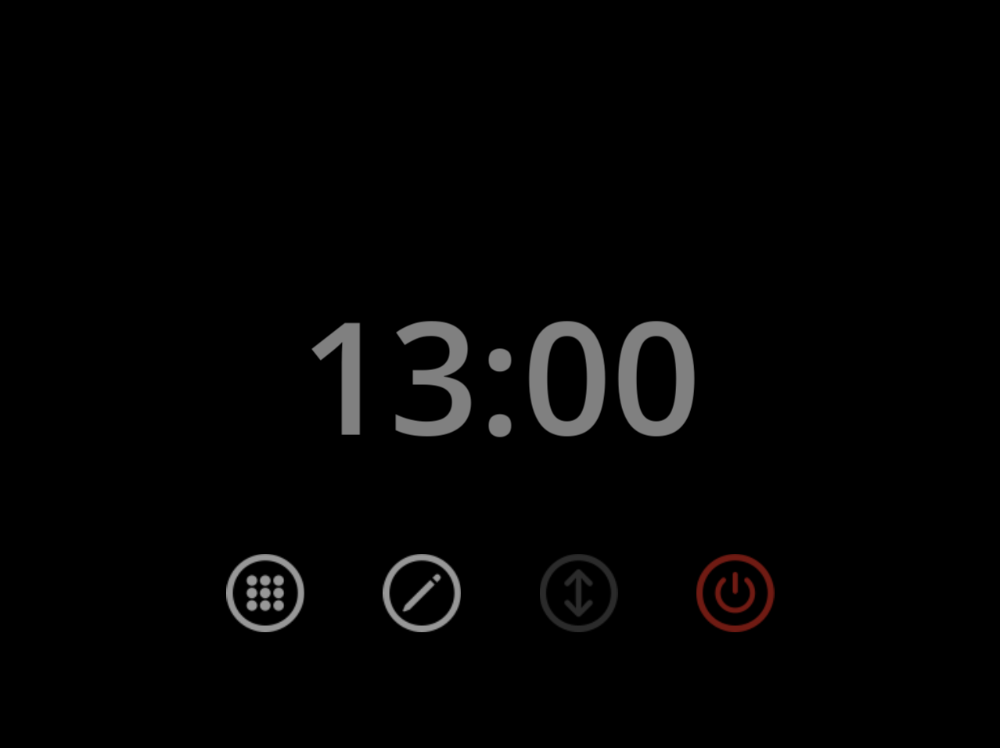
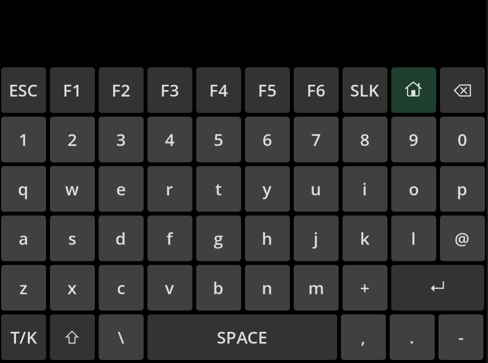
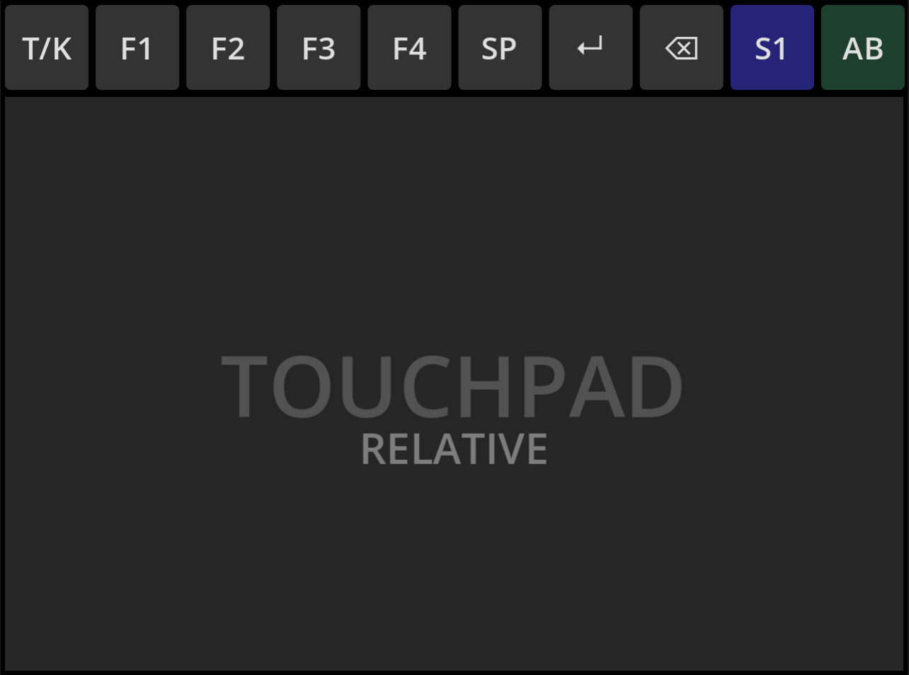
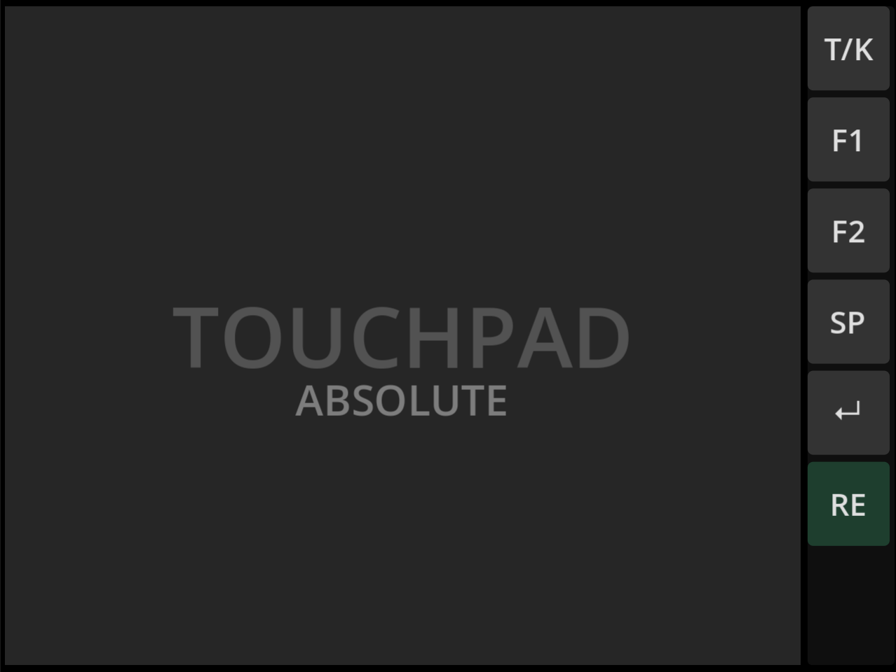

# VTK (Virtual Touchpad and Keyboard)

  
  
  
  

This lightweight project was developed and tested exclusively on **ROCKNIX** for the **Anbernic RG DS** handheld console. It enables the use of the secondary screen as a touchpad (supporting both relative and absolute positioning) or a virtual keyboard across various emulators available on ROCKNIX.

> [!NOTE]
> Running this project on other dual-screen handheld devices will require manual modifications and adaptations.

## Tested Emulators

VTK has been successfully tested on the following emulators and cores:
* **Amiga** (RetroArch - `puae` core)
* **PC** (RetroArch - `dosbox-pure` core)
* **Philips CD-i** (RetroArch - `same_cdi` core)
* **Commodore 64** (RetroArch - `Vice x64` core)
* **Super Nintendo** (RetroArch - `Snes9x` core)
* **ScummVM**
* **PortMaster**

## Simple Installation

1. Connect to your console or insert its SD card into your computer.
2. Copy the entire contents of the `otherFiles` folder into the `/storage/.config` directory on your console.
3. Restart the console.

### Uninstallation
This installation is completely non-destructive and will not overwrite any system files. To uninstall, simply delete the files you manually copied into the `/storage/.config` folder.

> [!WARNING]
> **RetroArch Virtual Controller Disruption**: Installing this project will currently disable the native RetroArch Virtual Controller. A solution to make both features coexist is still under evaluation.
